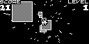

# ArduboyWorks  

Making mini games for [Arduboy](https://www.arduboy.com/).

[My repository information (JSON)](https://obono.github.io/ArduboyWorks/repo.json) \
[Repository viewer](https://obono.github.io/ArduboyWorks/?repo.json)

## Products

* OBN-Y02 [Hopper](https://community.arduboy.com/t/hopper-a-simple-action-game/4293)
  * Jump on panels and go up (foreground side). If you fall toward bottom, the game is over.
  * Depends on Arduboy Library 1.1.1\
     

## License

These codes are licensed under [MIT License](LICENSE).
