# Arduboy Playdate Ports

A collection of ported games + a drop in replacement library for [Arduboy2](https://github.com/MLXXXp/Arduboy2/) / [ArduboyPlaytune](https://github.com/Arduboy/ArduboyPlaytune) / [ArduboyTones](https://github.com/MLXXXp/ArduboyTones)

Initial Port was done by [Eric Lewis](https://github.com/ericlewis), additional fixes done by [joyrider3774](https://github.com/joyrider3774), game porters are listed in the games section

## Games

| Game<br>Download | Screenshot | Author | Porter | License | Link |
|-----------------|------------|--------|--------|---------|------|
| [ArduGolf](https://github.com/joyrider3774/playdate-arduboy/releases/latest/download/ArduGolf.pdx.zip) | 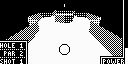 | [brow1067.](https://github.com/tiberiusbrown) | [joyrider3774](https://github.com/joyrider3774) | [MPL-2.0](ArduGolf/LICENSE.txt) | [Community](https://community.arduboy.com/t/ardugolf-18-hole-mini-golf/10462) |
| [Arduminer](https://github.com/joyrider3774/playdate-arduboy/releases/latest/download/Arduminer.pdx.zip) | 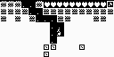 | [Bergasms](https://www.bergasms.com/) | [Eric Lewis](https://github.com/ericlewis) | No License | [Community](https://community.arduboy.com/t/arduminer-terraria-like-game-by-bergasms/2939) |
| [Arduventure](https://github.com/joyrider3774/playdate-arduboy/releases/latest/download/Arduventure.pdx.zip) | 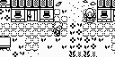 | [TEAM A.R.G.](https://github.com/Team-ARG-Museum) | [joyrider3774](https://github.com/joyrider3774) | [MIT](Arduventure/LICENSE) | [Community](https://community.arduboy.com/t/arduventure-rpg/505) |
| [Ardynia](https://github.com/joyrider3774/playdate-arduboy/releases/latest/download/Ardynia.pdx.zip) |  | [Matt Greer](https://github.com/city41) | [joyrider3774](https://github.com/joyrider3774) | [MIT](Ardynia/LICENSE) | [Community](https://community.arduboy.com/t/ardynia-an-elvish-adventure/6336) |
| [Begemmed](https://github.com/joyrider3774/playdate-arduboy/releases/latest/download/Begemmed.pdx.zip) | 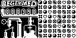 | [TEAM A.R.G.](https://github.com/Team-ARG-Museum) | [Eric Lewis](https://github.com/ericlewis) | [MIT](Begemmed/LICENSE) | [Community](https://community.arduboy.com/t/begemmed-fourth-team-a-r-g-game/515) |
| [Blob Attack](https://github.com/joyrider3774/playdate-arduboy/releases/latest/download/BlobAttack.pdx.zip) |  | [TEAM A.R.G.](https://github.com/Team-ARG-Museum) | [Eric Lewis](https://github.com/ericlewis) | [MIT](Blob%20Attack/LICENSE) | [Community](https://community.arduboy.com/t/blob-attack-first-native-team-a-r-g-game/283) |
| [Bone Shakers](https://github.com/joyrider3774/playdate-arduboy/releases/latest/download/BoneShakers.pdx.zip) |  | [James Howard](https://github.com/jhhoward/) | [Eric Lewis](https://github.com/ericlewis) | [GPL-3.0](Bone%20Shakers/LICENSE) | [Community](https://community.arduboy.com/t/bone-shakers-unofficial-game-jam-4/6406) |
| [Bubble Pop](https://github.com/joyrider3774/playdate-arduboy/releases/latest/download/BubblePop.pdx.zip) |  | [TEAM A.R.G.](https://github.com/Team-ARG-Museum) | [Eric Lewis](https://github.com/ericlewis) | [MIT](Bubble%20Pop/LICENSE) | [Github](https://github.com/Team-ARG-Museum/ID-14-Bubble-PoP) |
| [Candlelight](https://github.com/joyrider3774/playdate-arduboy/releases/latest/download/Candlelight.pdx.zip) |  | Matthew Bryan | [Matheus Nícolas](https://github.com/matheusnicolas) | Unknown | [Community](https://community.arduboy.com/t/candlelight-a-platformer/12006) |
| [CastleBoy](https://github.com/joyrider3774/playdate-arduboy/releases/latest/download/CastleBoy.pdx.zip) | 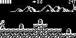 | [jlauener](https://github.com/jlauener) | [Eric Lewis](https://github.com/ericlewis) | [MIT](CastleBoy/LICENSE) | [Community](https://community.arduboy.com/t/castleboy-castlevania-demake/3011) |
| [Catacombs](https://github.com/joyrider3774/playdate-arduboy/releases/latest/download/Catacombs.pdx.zip) | 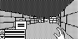 | [James Howard](https://github.com/jhhoward/),<br>Abeno Studio | [Eric Lewis](https://github.com/ericlewis) | [MIT](Arduboy3d/LICENSE) | [Community](https://community.arduboy.com/t/catacombs-of-the-damned-formerly-another-fps-style-3d-demo/6565) |
| [Crates](https://github.com/joyrider3774/playdate-arduboy/releases/latest/download/Crates.pdx.zip) | 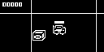 | [compycore](https://github.com/jessemillar) | [Eric Lewis](https://github.com/ericlewis) | [MIT](Crates/LICENSE) | [Community](https://community.arduboy.com/t/crates-pedal-to-the-metal-car-crime/6744) |
| [Dark and Under](https://github.com/joyrider3774/playdate-arduboy/releases/latest/download/DarkAndUnder.pdx.zip) | 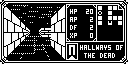 | [Garage Collective](https://github.com/Garage-Collective) | [joyrider3774](https://github.com/joyrider3774) | [BSD 3-Clause](Dark-And-Under/LICENSE) | [Community](https://community.arduboy.com/t/dark-under-a-dungeon-crawler/4637) |
| [Dice of Fate](https://github.com/joyrider3774/playdate-arduboy/releases/latest/download/DiceOfFate.pdx.zip) |  | [TEAM A.R.G.](https://github.com/Team-ARG-Museum) | [Eric Lewis](https://github.com/ericlewis) | [MIT](Dice%20of%20Fate/LICENSE) | [Community](https://community.arduboy.com/t/dice-of-fate-seventh-team-a-r-g-game/1101) |
| [Dino](https://github.com/joyrider3774/playdate-arduboy/releases/latest/download/Dino.pdx.zip) |  | [Ashteroide](https://github.com/Ashteroide) | [Eric Lewis](https://github.com/ericlewis) | [Apache-2.0 license](Dino/LICENSE) | [Community](https://community.arduboy.com/t/ardu-dino-like-chrome-dino-but-for-the-arduboy/9719) |
| [Do You<br>Remember Love](https://github.com/joyrider3774/playdate-arduboy/releases/latest/download/DyrLove.pdx.zip) | 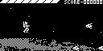 | [CoBinee](https://github.com/CoBinee) | [joyrider3774](https://github.com/joyrider3774) | Unknown | [Github](https://github.com/CoBinee/dyrlove-arduboy) |
| [Epic Crates Of<br>Mass Desctruction](https://github.com/joyrider3774/playdate-arduboy/releases/latest/download/Epic_Crates.pdx.zip) |  | [TEAM A.R.G.](https://github.com/Team-ARG-Museum) | [joyrider3774](https://github.com/joyrider3774) | [MIT](Epic%20Crates%20Of%20Mass%20Desctruction/LICENSE) | [Github](https://github.com/Team-ARG-Museum/ID-33-ECOMD) |
| [Escaper Droid](https://github.com/joyrider3774/playdate-arduboy/releases/latest/download/EscaperDroid.pdx.zip) |  | [TEAM A.R.G.](https://github.com/Team-ARG-Museum) | [Eric Lewis](https://github.com/ericlewis) | [MIT](Escaper%20Droid/LICENSE) | [Github](https://github.com/Team-ARG-Museum/ID-20-Escaper-Droid) |
| [Evasion](https://github.com/joyrider3774/playdate-arduboy/releases/latest/download/Evasion.pdx.zip) |  | [Obono](https://github.com/obono) | [joyrider3774](https://github.com/joyrider3774) | [MIT](Evasion/LICENSE.txt) | [Community](https://community.arduboy.com/t/evasion-a-simple-action-game/9226) |
| [Fast](https://github.com/joyrider3774/playdate-arduboy/releases/latest/download/Fast.pdx.zip) | 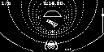 | [Byron Holldorf](https://github.com/byronholldorf/)<br>Filmote (Tinyfont) | [Matheus Nícolas](https://github.com/matheusnicolas) | [BSD 3-Clause](Fast/License.txt) | [Community](https://community.arduboy.com/t/fast-a-tube-racing-game/10813) |
| [Hollow Seeker](https://github.com/joyrider3774/playdate-arduboy/releases/latest/download/HollowSeeker.pdx.zip) |  | [Obono](https://github.com/obono) | [joyrider3774](https://github.com/joyrider3774) | [MIT](Hollow%20Seeker/LICENSE.txt) | [Community](https://community.arduboy.com/t/hollow-seeker-a-simple-action-game/2594) |
| [Hopper](https://github.com/joyrider3774/playdate-arduboy/releases/latest/download/Hopper.pdx.zip) | 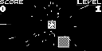 | [Obono](https://github.com/obono) | [joyrider3774](https://github.com/joyrider3774) | [MIT](Hopper/LICENSE.txt) | [Community](https://community.arduboy.com/t/hopper-a-simple-action-game/4293) |
| [Jet Pac](https://github.com/joyrider3774/playdate-arduboy/releases/latest/download/JetPac.pdx.zip) |  | [TheArduinoGuy](https://github.com/thearduinoguy) | [Eric Lewis](https://github.com/ericlewis) | Unknown | [Community](https://community.arduboy.com/t/arduboy-jet-pac/2888) |
| [MayQ](https://github.com/joyrider3774/playdate-arduboy/releases/latest/download/MayQ.pdx.zip) | 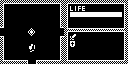 | [CoBinee](https://github.com/CoBinee) | [joyrider3774](https://github.com/joyrider3774) | Unknown | [Github](https://github.com/CoBinee/mayq-arduboy) |
| [Mystic Balloon](https://github.com/joyrider3774/playdate-arduboy/releases/latest/download/MysticBalloon.pdx.zip) |  | [TEAM A.R.G.](https://github.com/Team-ARG-Museum) | [Eric Lewis](https://github.com/ericlewis) | [MIT](Mystic%20Balloon/LICENSE) | [Community](https://community.arduboy.com/t/mystic-balloon-9th-team-a-r-g-game-39-levels/1983) |
| [Petit of the dead](https://github.com/joyrider3774/playdate-arduboy/releases/latest/download/PotDead.pdx.zip) | 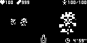 | [CoBinee](https://github.com/CoBinee) | [joyrider3774](https://github.com/joyrider3774) | Unknown | [Github](https://github.com/CoBinee/potdead-arduboy) |
| [Pocket Fighter](https://github.com/joyrider3774/playdate-arduboy/releases/latest/download/PocketFighter.pdx.zip) |  | Wang Renxin | [Eric Lewis](https://github.com/ericlewis) | [CC BY-NC-SA](Pocket%20Fighter/license.txt) | [Community](https://community.arduboy.com/t/pocket-fighter-an-ftg/2989) |
| [Reverse Mermaid<br>Hockey](https://github.com/joyrider3774/playdate-arduboy/releases/latest/download/ReverseMermaidHockey.pdx.zip) |  | [TEAM A.R.G.](https://github.com/Team-ARG-Museum) | [Eric Lewis](https://github.com/ericlewis) | [MIT](Reverse%20Mermaid%20Hockey/LICENSE) | [Community](https://community.arduboy.com/t/reverse-mermaid-hockey-third-team-a-r-g-game/355) |
| [Reversi](https://github.com/joyrider3774/playdate-arduboy/releases/latest/download/Reversi.pdx.zip) | 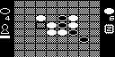 | [Obono](https://github.com/obono) | [joyrider3774](https://github.com/joyrider3774) | [MIT](Reversi/LICENSE.txt) | [Community](https://community.arduboy.com/t/reversi-a-simple-board-game/6754) |
| [SanSan](https://github.com/joyrider3774/playdate-arduboy/releases/latest/download/SanSan.pdx.zip) | 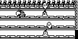 | Chamekan | [joyrider3774](https://github.com/joyrider3774) | Unknown | [Community](https://community.arduboy.com/t/sansan-son-son-rygar-inspired-action-game/4621) |
| [SFZ](https://github.com/joyrider3774/playdate-arduboy/releases/latest/download/SFZ.pdx.zip) | 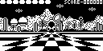 | [CoBinee](https://github.com/CoBinee) | [joyrider3774](https://github.com/joyrider3774) | Unknown | [Github](https://github.com/CoBinee/sfz-arduboy) |
| [Shadow Runner](https://github.com/joyrider3774/playdate-arduboy/releases/latest/download/ShadowRunner.pdx.zip) |  | [TEAM A.R.G.](https://github.com/Team-ARG-Museum) | [Eric Lewis](https://github.com/ericlewis) | [MIT](Shadow%20Runner/LICENSE) | [Community](https://community.arduboy.com/t/shadow-runner-first-conversion-of-a-team-a-r-g-game/239) |
| [Sirene](https://github.com/joyrider3774/playdate-arduboy/releases/latest/download/Sirene.pdx.zip) | 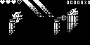 | [TEAM A.R.G.](https://github.com/Team-ARG-Museum) | [joyrider3774](https://github.com/joyrider3774) | [MIT](Sirene/LICENSE) | [Community](https://community.arduboy.com/t/sirene-tenth-team-a-r-g-game/2206) |
| [Stellar Impact](https://github.com/joyrider3774/playdate-arduboy/releases/latest/download/StellarImpact.pdx.zip) |  | [Gnargle](https://github.com/gnargle) | [joyrider3774](https://github.com/joyrider3774) | [MIT](Stellar%20Impact/License.txt) | [Community](https://community.arduboy.com/t/stellar-impact-a-space-shoot-em-up/994) |
| [Tackle Box](https://github.com/joyrider3774/playdate-arduboy/releases/latest/download/Tacklebox.pdx.zip) | 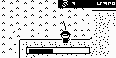 | [Matt Greer](https://github.com/city41) | [joyrider3774](https://github.com/joyrider3774) | [MIT<br>(code only)](Tacklebox/LICENSE) | [Community](https://community.arduboy.com/t/tackle-box-a-fishing-adventure/6777) |
| [Train Dodge](https://github.com/joyrider3774/playdate-arduboy/releases/latest/download/TrainDodge.pdx.zip) |  | [Crait](https://crait.net/) | [Eric Lewis](https://github.com/ericlewis) | Unknown | [Community](https://community.arduboy.com/t/train-dodge-single-button-reflex-game/2099) |
| [Trials of Astarok](https://github.com/joyrider3774/playdate-arduboy/releases/latest/download/TrialsOfAstarok.pdx.zip) | 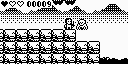 | [Vampirics,<br>Filmote,<br>Gibs](https://github.com/Press-Play-On-Tape)<br>[Pharap](https://github.com/Pharap) | [joyrider3774](https://github.com/joyrider3774) | [BSD 3-Clause](TrialsOfAstarok/LICENSE) | [Community](https://community.arduboy.com/t/trials-of-astarok-1-0-5/10262) |
| [Trolly Fish](https://github.com/joyrider3774/playdate-arduboy/releases/latest/download/TrollyFish.pdx.zip) |  | [TEAM A.R.G.](https://github.com/Team-ARG-Museum) | [joyrider3774](https://github.com/joyrider3774) | [MIT](Trolly%20Fish/LICENSE) | [Community](https://community.arduboy.com/t/trolly-fish-sixth-team-a-r-g-game/929) |
| [Umeroose](https://github.com/joyrider3774/playdate-arduboy/releases/latest/download/Umeroose.pdx.zip) |  | [CoBinee](https://github.com/CoBinee) | [joyrider3774](https://github.com/joyrider3774) | Unknown | [Github](https://github.com/CoBinee/umeroose-arduboy) |
| [Virus LQP-79](https://github.com/joyrider3774/playdate-arduboy/releases/latest/download/VirusLQP79.pdx.zip) | 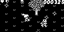 | [TEAM A.R.G.](https://github.com/Team-ARG-Museum) | [Eric Lewis](https://github.com/ericlewis) | [MIT](VIRUS-LQP-79/LICENSE) | [Community](https://community.arduboy.com/t/virus-lqp-79-eighth-team-a-r-g-game/1646) |
| [Waternet](https://github.com/joyrider3774/playdate-arduboy/releases/latest/download/Waternet.pdx.zip) | 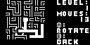 | [joyrider3774](https://github.com/joyrider3774) | [joyrider3774](https://github.com/joyrider3774) | [MIT](waternet/LICENSE) | [Community](https://community.arduboy.com/t/waternet-a-net-netslide-puzzle-game/10483) |

## Instructions

### Prerequisites

Before building, make sure you have:

1. **Playdate SDK** installed
   - macOS: install via the [Playdate website](https://play.date/dev/). The SDK path is auto-detected from `~/.Playdate/config`.
   - Linux/Windows: set the `PLAYDATE_SDK_PATH` environment variable pointing to your SDK folder (e.g. `export PLAYDATE_SDK_PATH=/path/to/PlaydateSDK`).

2. **CMake 3.19+**
   ```bash
   cmake --version
   ```

3. **`playdate-cpp` submodule** initialized. From the repository root:
   ```bash
   git submodule update --init
   ```

### Building

All commands are run from the **repository root** (not in a games folder).

### 1. Create the build directory

```bash
mkdir build
cd build
```

### 2. Configure with CMake

**macOS** (SDK path is auto-detected):
```bash
cmake ..
```

**Linux / Windows** (set SDK path explicitly if not set already):
```bash
PLAYDATE_SDK_PATH=/path/to/PlaydateSDK cmake ..
```

### 3. Build

only a single game for example the Fast game

```bash
cmake --build . --target Fast
```

Or build all games in the repository:
```bash
cmake --build . --config Release
```

### 4. Locate the output

After a successful build, the `.pdx` bundle is placed inside the game folder:

for example:

```
Fast/Fast.pdx/
```

### 5. Running on the Playdate Simulator

Open the Playdate Simulator, then drag and drop a game for example `Fast/Fast.pdx` onto it — or use **File → Open** and select the `Fast.pdx` folder.


### 6. Running on a physical Playdate

1. Connect your Playdate via USB.
2. In the Playdate Simulator, go to **Device → Upload Game to Device** and select `Fast/Fast.pdx`.

Alternatively, use the Playdate web interface at `device.play.date` to sideload the `.pdx` directly.

### 7. Troubleshooting

| Problem | Solution |
|---|---|
| `cmake ..` fails with "SDK not found" | Set `PLAYDATE_SDK_PATH` explicitly (see step 2) |
| `git submodule` errors | Run `git submodule update --init` from the repo root |
| Build errors in `playdate-cpp` | Make sure the submodule was fully initialized; re-run `git submodule update --init --recursive` |
| `.pdx` not appearing | Check that the build completed without errors; the output goes to `[Game]/[Game].pdx/` |

## Licenses
- Games that had licenses on their repo's as well as a readme.md are included in each games subdirectory
- ArduboyTones, ArduboyPlaytune and Arduboy2 licences and readme's can be found in `Licenses` Directory
